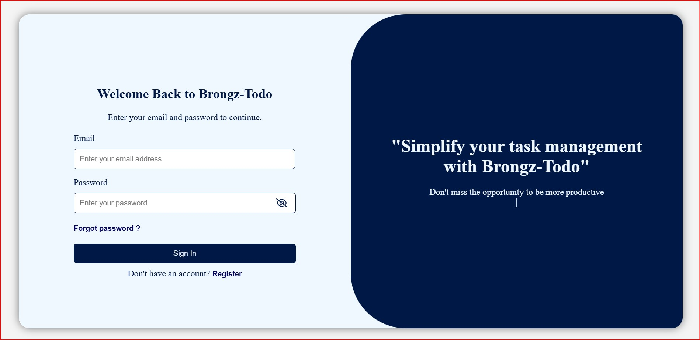
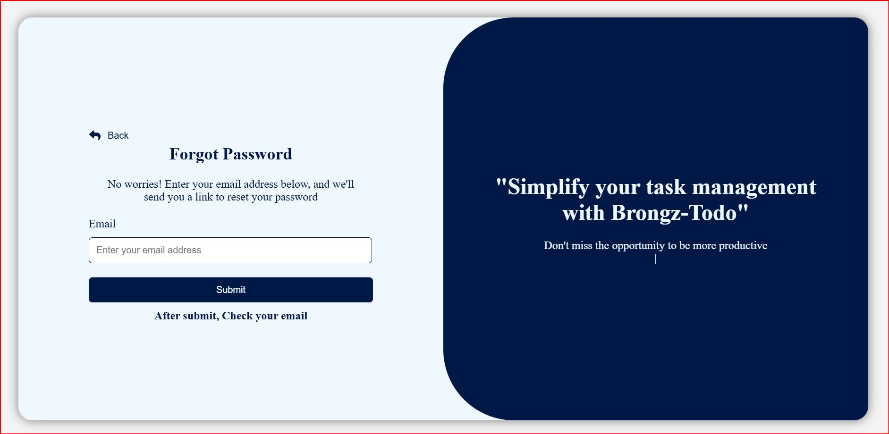
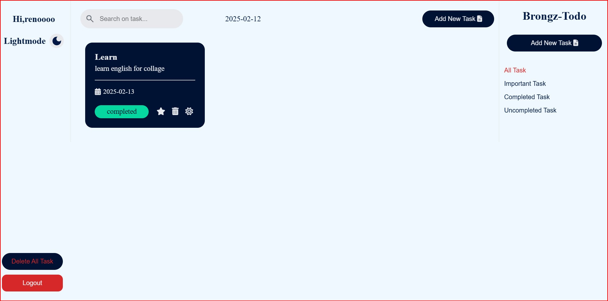
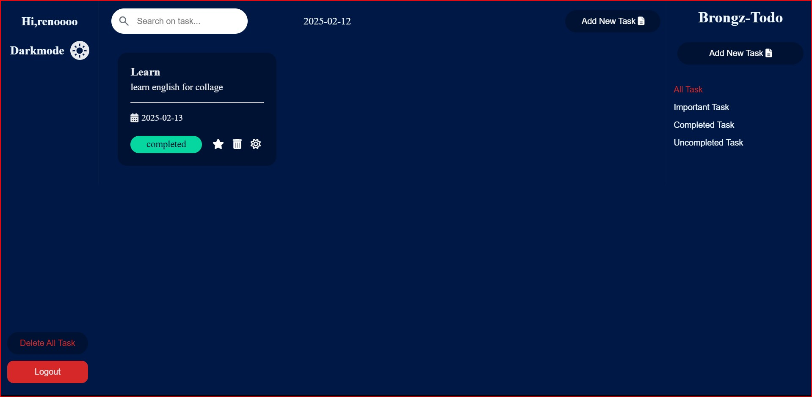
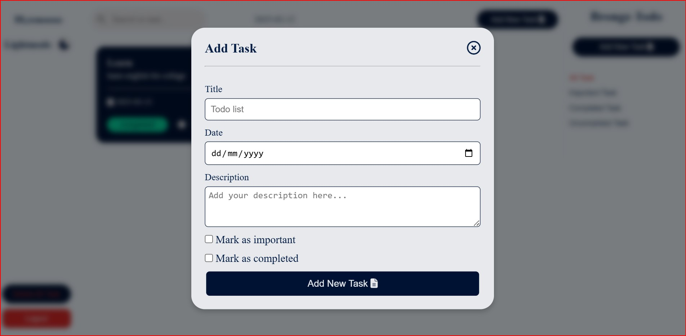
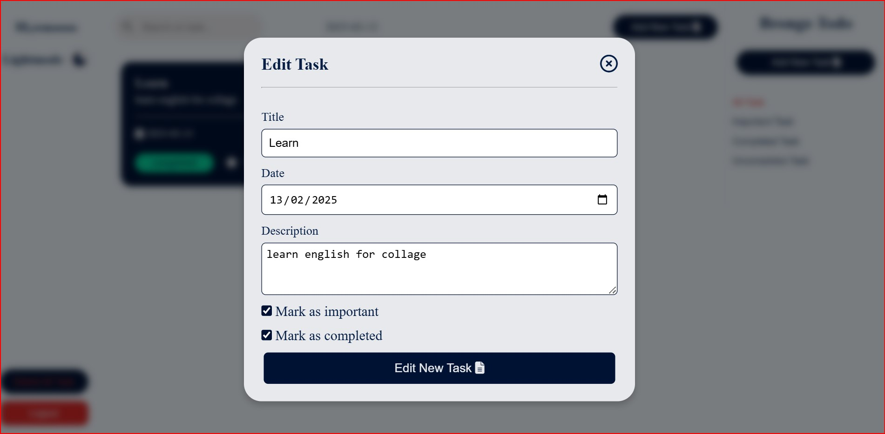
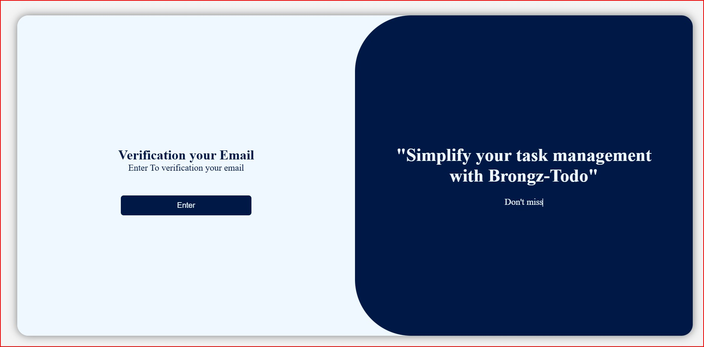
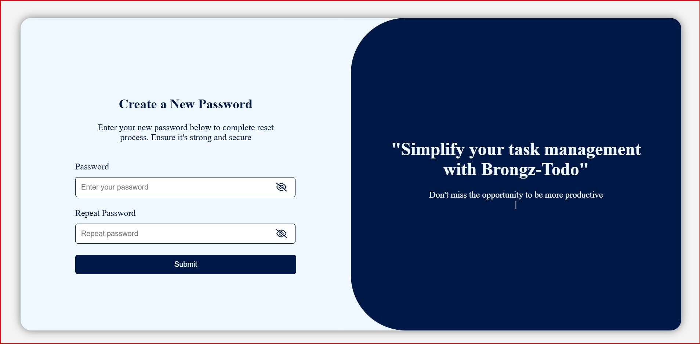

# Brongz-Todo

## Run code
```
npm run dev (Runs the application in development mode with Nodemon)
npm run start (production)
npm run lint (Runs ESLint to check code)
npm run lint:fix (Runs ESLint to fix code issues)
npm run test (Runs vitest to run tests)
npm run prettier-format (Format code with prettier)
npm run prettier-fix (Format code and fix issues with prettier)
```

## Endpoint
>open this endpoint for view
```
http://localhost:5500/auth
```


## About
Brongz todo is an app or website that is a clone of (Todo-List)(https://github.com/ZiadSheriif/Todo-List?tab=readme-ov-file) to create task lists.

## views

<div align="center">
<h3 align='left'>Login</h3>
   
<h3 align='left'>Register</h3>
   
<h3 align='left'>Forgot password</h3>
   
<h3 align='left'>All Task</h3>
   
<h3 align='left'>Dark Mode</h3>
   
<h3 align='left'>Add Task</h3>
   
<h3 align='left'>Edit Task</h3>
   
<h3 align='left'>Verify Email</h3>
   
<h3 align='left'>Change Password</h3>
   
</div>
